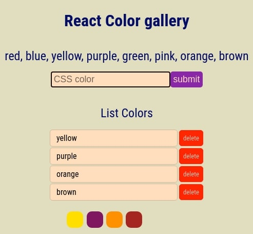
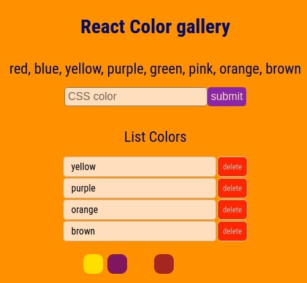

# React Class vs Hock

## Comparison of classes and hooks, using the life cycle components as an example.

- We display the data in the list and display the entered color under it
- Implement deletion from the list

- At start, we put the cursor in the input
- We clear the input field after adding a new color to the list and put the cursor in it again

- Check that it was impossible to send an empty form, displays alert with a warning
- You can enter not all colors only: red, blue, yellow, purple, green, pink, orange, brown
- If you entered the wrong color, then it will not be included in the list, while the input is not cleared, the person may have made a mistake with the letter
- But display an alert with a message that the entered data is not valid

- when loading the form, set the min max for the input that we receive by analyzing the list of colors, we get the min max length of words

- You can display only 6 colors in the list, if more then display an alert with a warning
- Colors cannot be entered the same, if you entered the same color, then just disable its addition and clear the form, display alert with a request to enter a different color

- When you click on one of the colors under the list, change the color of the entire page (body) to the selected one.

